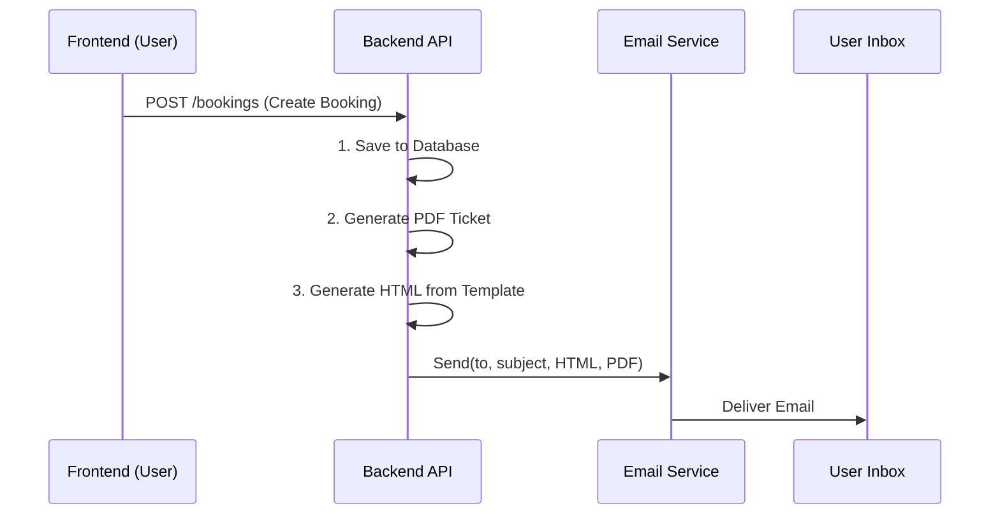

# Booking Confirmation Email Templates

## Overview
This document explains the implementation of the "Create email templates for booking confirmations" requirement. Usage of HTML templates creates a professional and branded experience for users receiving e-tickets.

## Feature Description
When a user completes a booking, they receive an automated email containing:
1.  **Booking Reference**: Unique ID for support.
2.  **Trip Details**: Route, Date, Time, and Bus information.
3.  **Passenger List**: Names and seat assignments.
4.  **Payment Summary**: Total amount paid.
5.  **PDF Attachment**: The official e-ticket file.

## Technical Implementation

### Architecture: Server-Side Rendering (SSR) for Emails
Unlike the web application frontend which uses React/Next.js client-side, email clients (Gmail, Outlook) accept static HTML. Therefore, the **Backend** acts as the renderer for these emails.

### File Structure
- **`src/booking/email.templates.ts`**: Contains the HTML/CSS generation function. This is where the visual design lives.
- **`src/booking/booking.service.ts`**: Imports the template and injects dynamic data (names, dates, prices) before sending.

## Why Backend?
You might wonder why we don't code this in the Frontend project.
1.  **Security**: We cannot trust the frontend to tell us "User paid 500,000 VND". The backend must look up the *real* price in the database to prevent fraud.
2.  **Consistency**: Emails are often triggered by background jobs (e.g., verifying a payment webhook), where no user frontend is open.

## How to Customize
To change the look and feel of the email, edit `src/booking/email.templates.ts`:

*   **Styles**: We use inline CSS (`style="..."`) because many email clients strip out external CSS files.
*   **Structure**: The HTML is standard table-based layout to ensure compatibility with older email clients (like Outlook).
